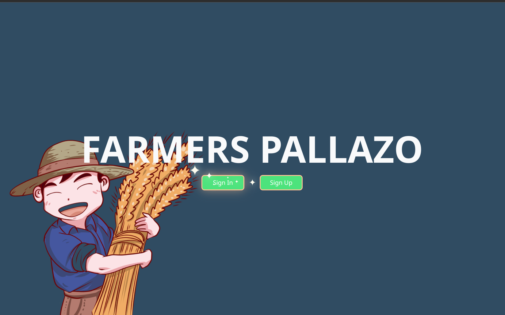

# Farm Hub: A Large Language Model AI-powered Disease Detection for Agriculture


Farm Hub is a large language model (LLM) designed to empower farmers with AI-powered insights and disease detection capabilities. Leveraging Meta's Finetuned Lllama-2-7b model, Farm Hub delivers over 90% accuracy in identifying plant diseases through image recognition.

## Authors
- [@andrew264](https://www.github.com/andrew264)
- [@ShadowConYT](https://www.github.com/ShadowConYT)
- [@spidy566](https://www.github.com/spidy566)


## Setup

1. Create a virtual environment:

   ```bash
   python -m venv venv
   ```

2. Install requirements:

   ```bash
   pip install -r requirements.txt
   ```

3. Run the servers:

   ```bash
   python flask_server/run.py
   python image-inference-server/start_image_inference.py
   python llm-inference-server/start_llm_inference.py
   ```

4. Access the application:

   Open [localhost:5000](http://localhost:5000) in your browser.

## Project Structure

The project is divided into three parts:

1. **`/flask_server`:**
   - Front-end of the project.
   - Run with `run.py`.

2. **`/image-inference-server`:**
   - Handles image inference using PyTorch.
   - Run with `start_image_inference.py`.
   - Uses a simple HTTP server.
   - Input: `{'image': 'base64 encoded image'}`
   - Output: `{'result': 'result of the inference'}` or `{'error': 'Invalid Image input'}`

3. **`/llm-inference-server`:**
   - Handles Llama-2 inference using the vLLm library.
   - Run with `start_llm_inference.py`.
   - Uses WebSockets for communication.
   - Input: `string`
   - Output: `string` (word by word)

## Models

### Llama-2 Chat Model

- Download from Huggingface: [link](https://huggingface.co/TheBloke/Llama-2-7B-Chat-AWQ)
- Set the downloaded model path in `llm_inference_server.py`.

### Image Classification Model

- Dataset: `datasets/images/(train|valid)`
- Training script: `train_imaage_classifier.py`
- Model weights: `models/convnext_small.pth`
- Number of classes: `models/num_classes.txt`


## Screenshots




